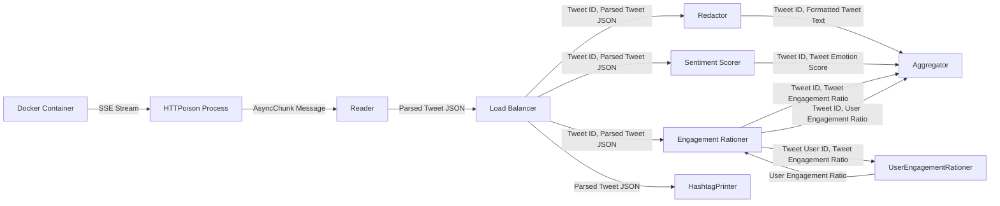

```mermaid
flowchart LR
    A[Docker Container]-->|SSE Stream| B[HTTPoison Process]
    B[HTTPoison Process]-->|AsyncChunk Message| C[Reader] 
    C[Reader]-->|Parsed Tweet JSON| D[Load Balancer]
    D[Load Balancer]-->|Tweet ID, Parsed Tweet JSON| F[Redactor]
    D[Load Balancer]-->|Tweet ID, Parsed Tweet JSON| G[Sentiment Scorer]
    D[Load Balancer]-->|Tweet ID, Parsed Tweet JSON| H[Engagement Rationer]
    D[Load Balancer]-->|Parsed Tweet JSON| E[HashtagPrinter]
    F[Redactor]-->|Tweet ID, Formatted Tweet Text| I[Aggregator]
    G[Sentiment Scorer]-->|Tweet ID, Tweet Emotion Score| I[Aggregator]
    H[Engagement Rationer]-->|Tweet ID, Tweet Engagement Ratio| I[Aggregator]
    H[Engagement Rationer]-->|Tweet User ID, Tweet Engagement Ratio| J[UserEngagementRationer]
    J[UserEngagementRationer]-->|User Engagement Ratio| H[Engagement Rationer]
    H[Engagement Rationer]-->|Tweet ID, User Engagement Ratio| I[Aggregator]
```